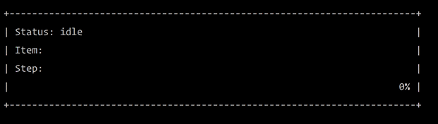

# ANSI Dashboard



## Running

```bash
$ git clone https://github.com/BaylorRae/ansi-dashboard.git
$ chmod u+x ./go
$ ./go
```

## Escape Code Reference

```
Cursor Controls:
   ESC[#;#H or ESC[#;#f Moves cusor to line #, column #
   ESC[#A Moves cursor up # lines
   ESC[#B Moves cursor down # lines
   ESC[#C Moves cursor forward # spaces
   ESC[#D Moves cursor back # spaces
   ESC[#;#R Reports current cursor line & column
   ESC[s Saves cursor position for recall later
   ESC[u Return to saved cursor position

Erase Functions:
   ESC[2J Clear screen and home cursor
   ESC[K Clear to end of line
```

## Todo

- [ ] add scrolling output from logging
